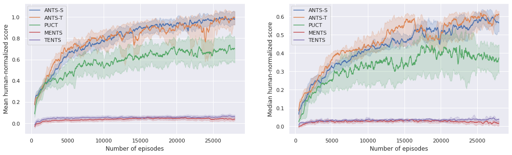

# Adaptive Entropy Tree Search

This repository contains code for the paper Planning and Learning using Adaptive Entropy Tree Search, accepted for IJCNN 2022.

## Install

```
pip install .
```

and download ROMs for Atari games by following [these steps](https://github.com/openai/atari-py#roms).

## Download pretrained networks

We use checkpoints provided by the authors of Dopamine. Download them from a Google Storage bucket:

```
gsutil cp gs://download-dopamine-rl/dqn_checkpoints.tar.gz ./
tar zxvf dqn_checkpoints.tar.gz
```

## Run

### Pre-trained networks

To reproduce our experiments with pretrained networks, run this command. Change `ants_s.gin` 
to different files from `configs/pretraied` to run any other algorithm. Set `Atari.game` to the game you want 
to evaluate on. Set `TFMetaGraphNetwork.model_path` to the checkpoint path. We use checkpoint 1 
for all games except for Breakout, where we use 2 - checkpoint 1 appears to be broken.

```
python -m alpacka.runner \
    --output_dir=./out \
    --config_file=configs/pretrained/ants_s.gin \
    --config 'Atari.game="alien"' \
    --config 'TFMetaGraphNetwork.model_path="dqn/Alien/1/tf_checkpoints/tf_ckpt-199"'

```

### Closed-loop training

Run the following command (no checkpoints needed). Change `ants_s.gin` to different files
from `configs/closed_loop` to run any other algorithm.

```
python -m alpacka.runner \
    --output_dir=./out \
    --config_file=configs/closed_loop/ants_s.gin \
    --config 'Atari.game="alien"'
```

### Ablations

Run the following command. Change `no_ada.gin` to different files from `configs/ablations` to run
other ablations.

```
python -m alpacka.runner \
    --output_dir=./out \
    --config_file=configs/ablations/no_ada.gin \
    --config 'Atari.game="alien"' \
    --config 'TFMetaGraphNetwork.model_path="dqn/Alien/1/tf_checkpoints/tf_ckpt-199"'

```

## Results

### Pre-trained networks

| game     | PUCT | MENTS | TENTS | ANTS-S | ANTS-T |
|-------|---------|----------|--------|----------|----------|
| Alien    | 2852.9 | 2590.1 | 2605.5 | 2783.3 | 2553.8  |
| Amidar    | 136.75 | 250.6 | 235.96 | 147.52 | 183.94  |
| Asterix    | 48505.5 | 8305.0 | 10405.5 | 51741.0 | 49758.0  |
| Asteroids    | 3656.5 | 3786.1 | 3540.6 | 4059.2 | 3554.3  |
| Atlantis    | 278156.0 | 275681.0 | 267429.0 | 277870.0 | 280492.0  |
| BankHeist    | 680.4 | 542.5 | 471.7 | 706.7 | 714.7  |
| BeamRider    | 21744.88 | 9423.6 | 7534.24 | 21268.46 | 18536.36  |
| Breakout    | 388.99 | 305.86 | 243.22 | 350.92 | 377.13  |
| Centipede    | 18661.52 | 59167.26 | 99630.69 | 51387.29 | 133841.7  |
| DemonAttack    | 55947.05 | 49952.2 | 45960.3 | 53998.35 | 53462.0  |
| Enduro    | 793.99 | 800.0 | 800.0 | 793.99 | 800.0  |
| Frostbite    | 204.3 | 196.5 | 196.5 | 179.1 | 184.0  |
| Gopher    | 9605.6 | 9330.0 | 8150.2 | 10770.0 | 10766.0  |
| Hero    | 20714.7 | 19939.85 | 19845.35 | 20617.5 | 20443.05  |
| MsPacman    | 3879.7 | 3873.4 | 3358.4 | 4922.7 | 4846.1  |
| Phoenix    | 8875.1 | 6788.3 | 6857.0 | 9187.4 | 9557.4  |
| Qbert    | 15120.0 | 13876.5 | 13815.0 | 15472.0 | 15223.0  |
| Robotank    | 54.68 | 26.82 | 26.39 | 49.22 | 51.11  |
| Seaquest    | 3269.7 | 1763.6 | 1532.7 | 2557.4 | 2656.4  |
| SpaceInvaders    | 4629.6 | 2042.6 | 2023.6 | 4713.5 | 4453.4  |
| WizardOfWor    | 11834.0 | 7063.0 | 8030.0 | 12937.0 | 13386.0  |

### Closed-loop training


### Robustness

